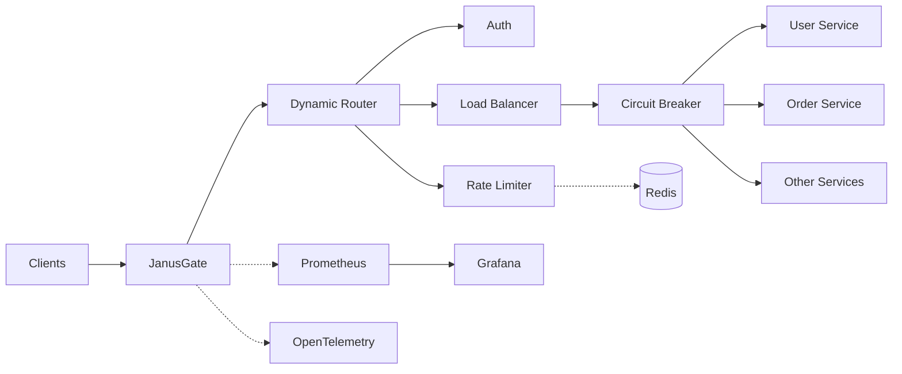

# JanusGate

> High-performance, cloud-native API gateway and reverse proxy written in Go.

JanusGate is a lightweight, distributed API gateway and reverse proxy written in Go. It sits in front of microservices and handles routing, security, traffic control, resilience, and observability.

## Features

| Area                   | Capabilities                                                                                    |
| ---------------------- | ----------------------------------------------------------------------------------------------- |
| **Routing & Proxying** | Exact-match and prefix routing, path stripping, dynamic configuration, zero-downtime hot reload |
| **Load Balancing**     | Round-Robin, Weighted Round-Robin, Least Connections, IP Hash                                   |
| **Rate Limiting**      | Redis-backed Token Bucket for distributed traffic control and abuse prevention                  |
| **Security**           | Centralized JWT validation and API Key management                                               |
| **Resilience**         | Circuit Breaker, exponential-backoff retries, active/passive health checks                      |
| **Observability**      | Prometheus metrics and OpenTelemetry distributed tracing                                        |
| **Cloud Native**       | Stateless gateway architecture, container-friendly deployment, horizontal scalability           |

## Architecture



### Request Flow

```text
Client
  │
  ▼
┌───────────────────────────────┐
│            JanusGate          │
│                               │
│  Routing → Auth → Rate Limit  │
│           → Load Balance      │
│           → Resilience        │
└───────────────┬───────────────┘
                │
        ┌───────┼────────┐
        ▼       ▼        ▼
     Service  Service  Service
        │
        └──────────► Redis
```

The architecture keeps the gateway lightweight while supporting horizontal scaling and centralized traffic control.

## Quick Start

### Prerequisites

Make sure you have:

- [Docker](https://docs.docker.com/get-docker/)
- Docker Compose
- Git

### 1. Clone the repository

```bash
git clone https://github.com/alan-shabrandi/JanusGate
cd JanusGate
```

### 2. Start the full local environment

```bash
docker compose up -d
```

This starts:

- JanusGate
- Redis
- Prometheus
- Grafana
- Three mock upstream services

### 3. Check the environment

```bash
docker compose ps
```

### 4. Stop the environment

```bash
docker compose down
```

## Local Endpoints

| Service     | URL                     | Purpose                      |
| ----------- | ----------------------- | ---------------------------- |
| API Gateway | `http://localhost:8080` | Main gateway endpoint        |
| Prometheus  | `http://localhost:9090` | Metrics and monitoring       |
| Grafana     | `http://localhost:3000` | Dashboards and visualization |

> **Note:** Update these ports if your `docker-compose.yaml` exposes different values.

## Configuration

Gateway behavior is defined through `config.yaml`.

Configuration changes are detected automatically and applied without requiring a process restart, enabling **hot reload** while preserving active connections.

### Example

```yaml
server:
  port: 8080
  read_timeout: 5s
  write_timeout: 10s

routes:
  - path_prefix: "/api/v1/users"
    strip_prefix: true

    rate_limit:
      enabled: true
      requests_per_second: 100

    circuit_breaker:
      enabled: true
      max_requests: 5

    upstreams:
      - url: "http://upstream-user-svc-1:8081"
        weight: 2

      - url: "http://upstream-user-svc-2:8081"
        weight: 1

    load_balancer: "least_connections"
```

### Supported Load-Balancing Strategies

```text
Round-Robin
Weighted Round-Robin
Least Connections
IP Hash
```

## Performance

Performance is an important part of the design.

The following figures are **example benchmark results** and should be replaced with measurements from your own environment before publishing them as official project claims.

| Metric           |    Example Result |
| ---------------- | ----------------: |
| Throughput       |   ~15,000 req/sec |
| Average Latency  |            < 2 ms |
| P99 Latency      |            < 5 ms |
| Memory Footprint | ~25 MB under load |

### Benchmark Environment

```text
Load Generator: k6
Upstream: Mock service
Machine: [Specify CPU / RAM / OS]
Gateway Version: [Specify version]
```

Run benchmarks locally with:

```bash
make benchmark
```

> Benchmark results depend heavily on CPU, network, workload, upstream latency, concurrency, and configuration. Always reproduce results in a controlled environment.

## Project Structure

```text
.
├── cmd/
│   └── gateway/              # Application entry point
│
├── internal/
│   ├── config/               # Configuration management
│   ├── proxy/                # Reverse proxy engine
│   ├── router/               # Dynamic routing tree
│   ├── loadbalance/          # Load-balancing algorithms
│   ├── ratelimit/            # Redis-backed rate limiter
│   └── metrics/              # Prometheus integration
│
├── docs/                     # Architecture & project documentation
│
├── Dockerfile                # Multi-stage Docker build
├── docker-compose.yaml       # Local development environment
├── config.yaml               # Gateway configuration
├── Makefile                  # Development commands
└── README.md                 # Project documentation
```

## Development

### Requirements

- **Go 1.22+**
- Docker
- Docker Compose
- `golangci-lint` for linting

### Run tests

```bash
make test
```

### Run linting

```bash
make lint
```

### Run the gateway locally

```bash
go run ./cmd/gateway
```

## Testing

Run the complete test suite:

```bash
make test
```

The project currently targets **>85% test coverage**.

To inspect coverage locally:

```bash
go test ./... -cover
```

For more detailed coverage:

```bash
go test ./... -coverprofile=coverage.out
go tool cover -html=coverage.out
```

## Observability

JanusGate provides native observability integrations.

### Prometheus

Metrics are exposed through the gateway's metrics endpoint and can be scraped by Prometheus.

Typical metrics can include:

```text
Request count
Request duration
HTTP status codes
Upstream errors
Rate-limit events
Circuit-breaker state
```

### OpenTelemetry

Distributed tracing can be integrated with OpenTelemetry-compatible collectors and backends.

```text
Client
  │
  ▼
Gateway ───────────────► OTel Collector
  │                           │
  ▼                           ▼
Upstream Services        Trace Backend
```

## Resilience

The gateway includes multiple mechanisms for handling unhealthy or overloaded upstream services.

### Circuit Breaker

Prevents repeated requests from reaching an unhealthy upstream after configured failure thresholds are exceeded.

### Retries

Failed requests can be retried using exponential backoff.

### Health Checks

Active and passive health checks help identify unavailable upstream instances and keep traffic away from unhealthy targets.

> Retry policies should be configured carefully for non-idempotent operations such as payments or state-changing requests.

## Security

JanusGate centralizes common API security concerns at the gateway layer.

### Authentication

- JWT validation
- API Key management

### Traffic Protection

- Distributed rate limiting
- Configurable request controls
- Circuit breaking
- Upstream health management

> Authentication, authorization, TLS termination, secret management, and network policies should be configured according to your deployment's security requirements.

## Docker

The project uses a multi-stage Docker build to produce a small production image.

Build the image:

```bash
docker build -t JanusGate:latest .
```

Run it:

```bash
docker run --rm -p 8080:8080 JanusGate:latest
```

For local development with dependencies and observability services, use:

```bash
docker compose up -d
```

## Configuration Hot Reload

JanusGate supports configuration hot reload.

```text
config.yaml
    │
    ▼
┌───────────────┐
│ Config Watcher │
└───────┬───────┘
        │
        ▼
┌───────────────┐
│ Runtime Config│
└───────┬───────┘
        │
        ▼
    Active Routes
```

Changes to routing and gateway behavior can be applied without restarting the gateway process.

## Contributing

Contributions are welcome.

### Development workflow

1. Fork the repository.
2. Create a feature branch.
3. Implement your changes.
4. Add or update tests.
5. Run the test suite.
6. Run linting.
7. Open a Pull Request with a clear description of the changes.

Before submitting:

```bash
make test
make lint
```

Please keep pull requests focused, tested, and easy to review.

## Roadmap

Potential future improvements:

- [ ] Admin API for runtime configuration
- [ ] More load-balancing strategies
- [ ] mTLS support
- [ ] WebSocket and gRPC optimizations
- [ ] Distributed configuration storage
- [ ] Advanced authentication providers
- [ ] Kubernetes-native deployment manifests
- [ ] Gateway-level caching
- [ ] More detailed dashboards and alerts

## Documentation

Additional documentation can live under:

```text
docs/
├── architecture/
├── configuration/
├── deployment/
├── observability/
└── development/
```

Architecture diagrams and operational guides should be kept close to the implementation and updated alongside major changes.

## License

This project is licensed under the **MIT License**.

See the [`LICENSE`](LICENSE) file for the complete license text.

## Support the Project

If you find JanusGate useful:

- Star the repository
- Report bugs
- Open feature requests
- Contribute improvements
- Improve the documentation

---

<div align="center">

**Built with Go**

[Documentation](docs/) · [Issues](../../issues) · [Pull Requests](../../pulls)

</div>
